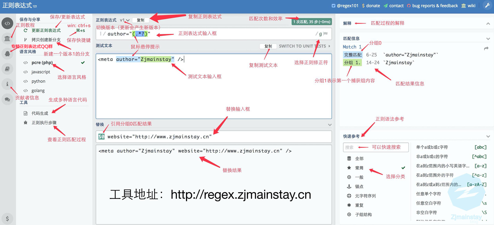

# RegexTesterForMac
A regular expression tester for Mac base on regex101.com

## Download App directly

[Regex101.zip](https://raw.githubusercontent.com/Zjmainstay/RegexTesterForMac/master/dist/Regex101.zip)

## Screenshot



----

## How to build a Mac App by yourself?

1. Install [MacGap](https://github.com/MacGapProject/MacGap1) 

   ```$ sudo gem install macgap```
2. Clone Project

   ```$ git clone https://github.com/Zjmainstay/RegexTesterForMac.git```
2. Build application:

    ```
    $ cd RegexTesterForMac
    $ sh ./install.sh
    ```


The build script generates an application, available inside the `build` folder.


## Base on
[https://www.regex101.com](https://www.regex101.com)

## Idea from
This app came from the idea of [aurbano/regex101-osx](https://github.com/aurbano/regex101-osx). But it could not use when I download from aurbano/regex101-osx, so I create this repository for a new one.


### Perhaps Error && Solution

```
#1
ERROR:  Could not find a valid gem 'macgap' (>= 0), here is why:
          Unable to download data from https://rubygems.org/ - Errno::EPIPE: Broken pipe - 
        SSL_connect (https://rubygems.org/latest_specs.4.8.gz)

Solution:
gem source -r https://rubygems.org/
gem source -a http://rubygems.org/

```

